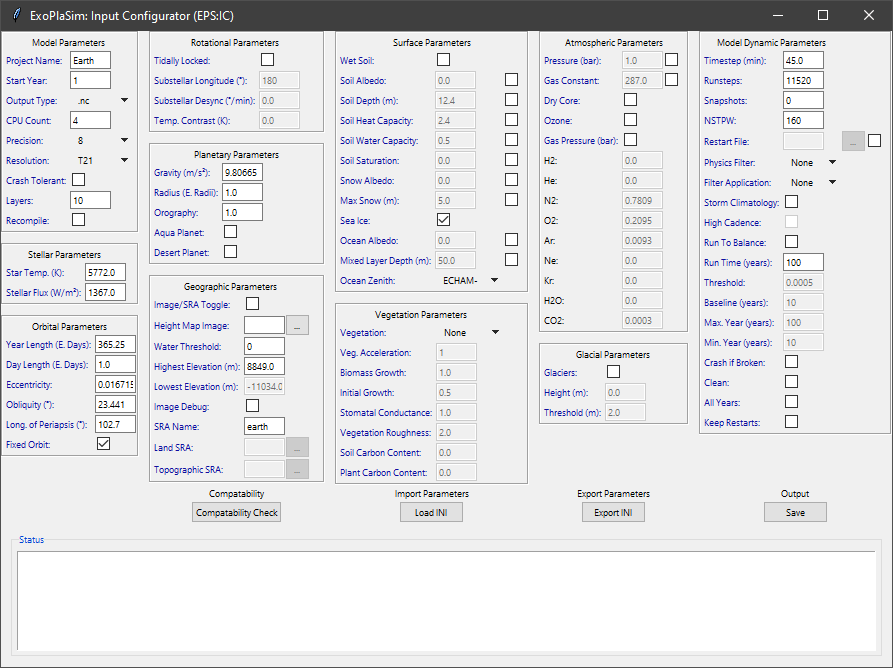

# ExoPlaSim-InCon

A user-friendly interface for configuring an [ExoPlaSim](https://github.com/alphaparrot/ExoPlaSim) .py file.
## Features
- [x] Easy-to-use layout, sorted into categorised panels.
- [x] Image->SRA file converter for easy geographic implementation.
- [x] Helpful tips via clicking on coloured-text
- [x] Works on all platforms (Windows, Mac, Lunix)
  - _NOTE: ExoPlaSim as of now still operates in a Linux-based environment, this just makes it easier for those less skilled in programming._

## Future Ideas
- [ ] Complete compatibility checker, to warn the user if something will mess up or crash ExoPlaSim.
- [ ] Improvements to UI layout.
- [ ] Import/Export Preset Files, saving the hassle of redoing settings.
- [ ] Import directly from ExoPlaSim .py file, this may or may not be possible.
- [ ] UI themes (eg. Dark Mode).
Any other ideas/suggestions welcome!

## Requirements
- numpy
- matplotlib
- PIL
- shutil
- ntpath
- tkinter
